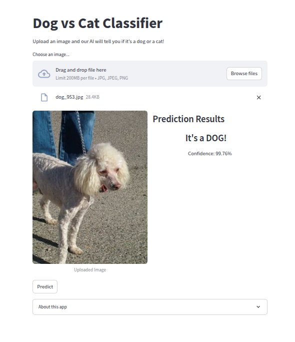

# AI Image Classification System

## Project Overview
This project implements an image classification system using transfer learning with a pre-trained ResNet18 model. The system consists of a FastAPI backend for handling the classification logic and a Streamlit frontend for user interaction.

## Features
- Transfer learning with ResNet18 pre-trained model
- Fine-tuning capabilities for custom datasets
- RESTful API endpoints for integration with other applications
- Performance metrics visualization

## Installation

### Prerequisites
- Python 3.10
- All the library are list in requirements.txt

### Setup
1. Clone the repository:
```bash
git clone https://github.com/phnguynmkhoi/cat_dog_classifier.git
cd cat_dog_classifier
```
2. Download dataset from kaggle:
```bash
bash script/download_dataset.sh
```
3. Fine-tune Resnet18:
```bash
python ai/training.py
```
4. Run the evaluation test (Optional):
```bash
python ai/evaluation.py
```
5. Run the backend server:
```bash
python backend/app.py
```
6. Run the frontend server:
```bash
streamlit run frontend/app.py
```
Now you can visit [http://localhost:8501](http://localhost:8501) to test:
